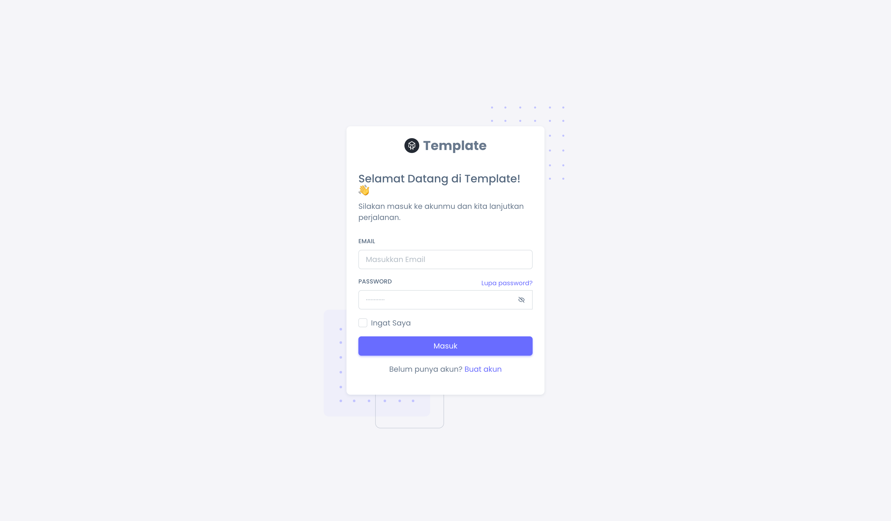
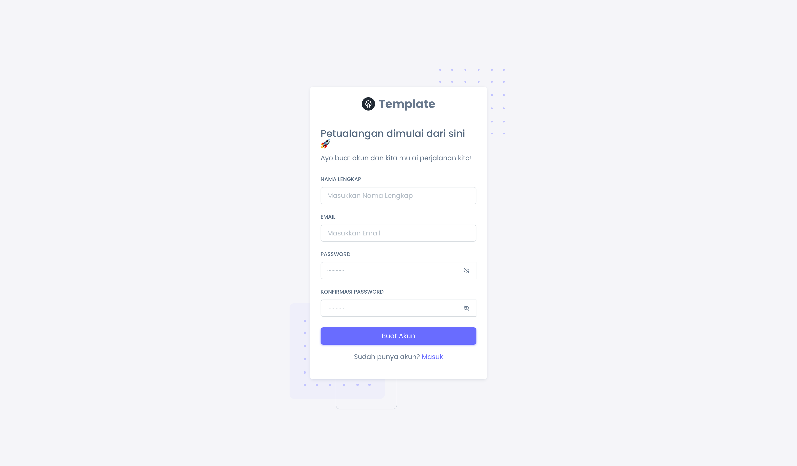
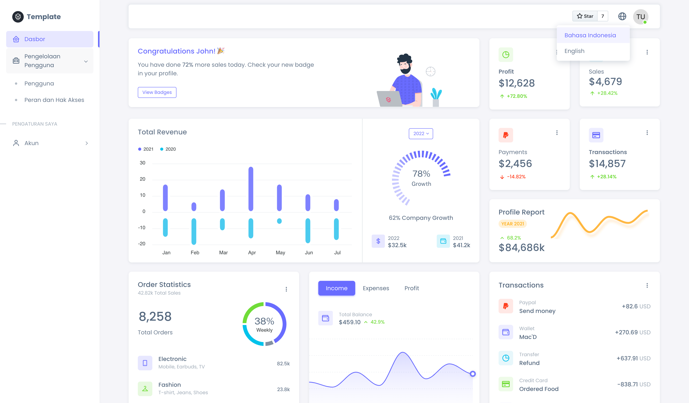
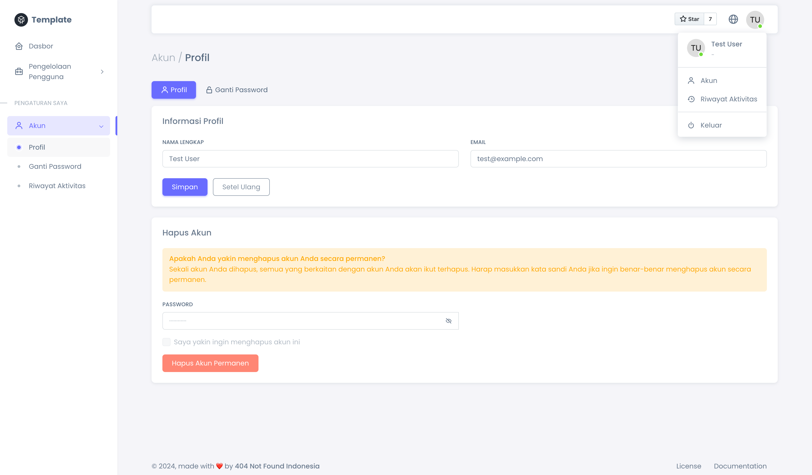
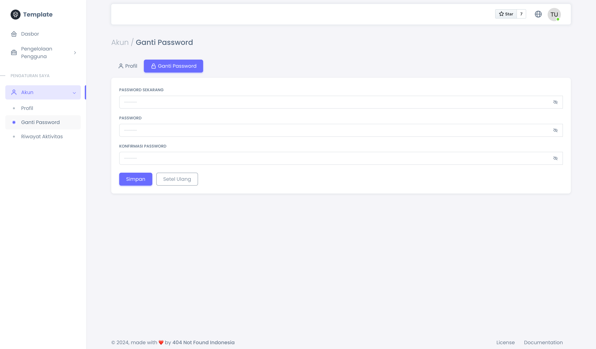
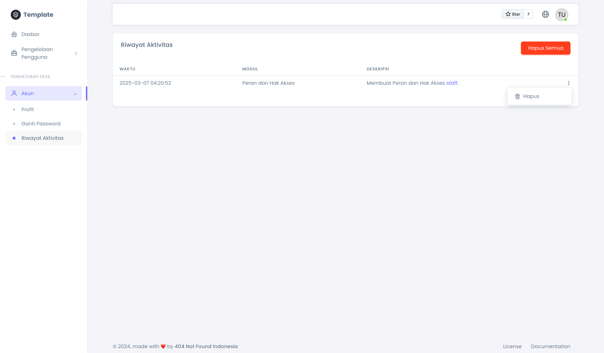
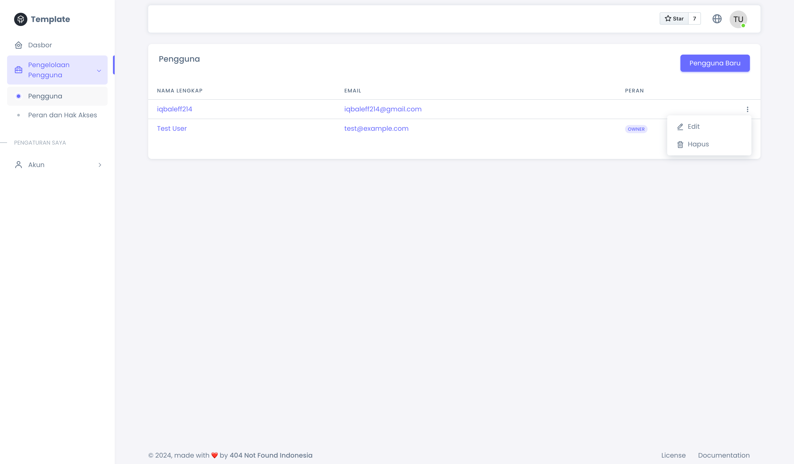
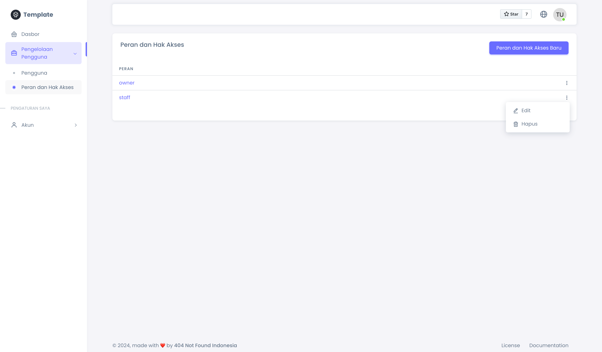
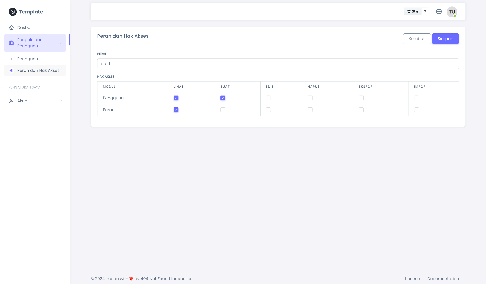

<div align="center">
    <p>
        <a href="https://github.com/404NotFoundIndonesia/" target="_blank">
            
        </a>
    </p>

 [](https://github.com/404NotFoundIndonesia/laravel-11-sneat-template/stargazers)
 [](https://github.com/404NotFoundIndonesia/laravel-11-sneat-template/blob/main/LICENSE)
 
</div>

# Laravel 11 Sneat Template

This is a Laravel 11 template designed to accelerate web application development by integrating the Sneat dashboard template and Laravel Breeze authentication.

## Available Features

- Authentication (Sign In, Sign Up, Forgot Password, Reset Password)
- Edit Account
- Change Password
- Delete Account
- Localization (Bahasa Indonesia, English)
- Role and Permission
- Activity Log

## Get Started with Docker

__First time only!__ Run the following command:

```shell
docker compose up -d --build
```
From the second time onwards, run the following command to start the services:

```shell
docker compose up -d
```

## Get Started Manually

### Get the Source Code
Of course, you need to put this code on your computer first. There are two ways to do this: by __downloading the project zip file__ or __by using Git (recommended)__.

1. **Download the Project Zip**

    You can click on [this link](https://github.com/404NotFoundIndonesia/laravel-11-sneat-template/archive/refs/heads/main.zip) to download the zip file of this project.

2. **Git Clone**

    Make sure that you have installed git. Open the directory where you want to place the source code in the terminal. Then, run the following command:
    ```shell
    git clone git@github.com:404NotFoundIndonesia/laravel-11-sneat-template.git
    ```

### Install Dependencies and Setup

Make sure __this project is open in your command line interface__. To confirm your current active directory in the terminal, use the following command: 
```shell
pwd
```

To install backend dependencies, use the following command:
```shell
composer setup
```

## Credentials

You can login with the following account as `owner`:
- email: `test@example.com`
- password: `password`

## Screenshots

### Login Page


### Registration Page


### Dashboard Page


### Profile Page


### Change Password Page


### Activity Log Page


### Users Page


### Roles Page



## Reference

- [Laravel](https://github.com/laravel/laravel)
- [Breeze](https://github.com/laravel/breeze)
- [Sneat Template](https://github.com/themeselection/sneat-bootstrap-html-admin-template-free)

## License

__Laravel 11 Sneat Template__ is open-sourced software licensed under the [MIT license](https://github.com/404NotFoundIndonesia/laravel-11-sneat-template?tab=MIT-1-ov-file).
